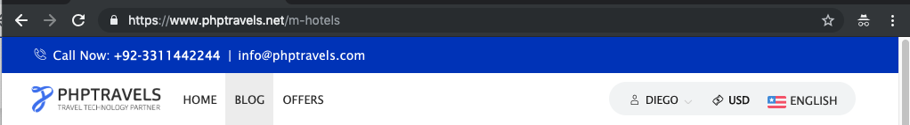
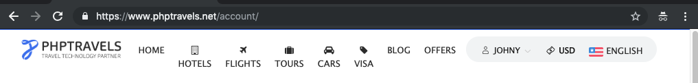

[phptravels.net](http://www.phptravels.net) _Test Automation_

end-to-end tests using pytest,pytest-bdd, Selenium

# Exercises: 

> 
##  Exercise 1:

> Implement end-to-end tests against http://www.phptravels.net (a test website) using Python, pytest, pytest-bdd, Selenium, and the Gherkin language for feature files.
The tests must ensure that the following scenarios are working correctly.

Page: http://www.phptravels.net Email: user@phptravels.com Password: demouser
- **Test 1** As an anonymous user who is already registered in the website, I want to be able to login and see my account page. 
- **Test 2** As an authenticated user, I want to be able to search for hotels for a given city, date and family size.

---

## Exercise 2:

> List, justify and implement tests that ensure our website is resilient against edge cases for the two cases listed in exercise 1. Being resilient means it can handle edge cases that can occur, like mistakes by the user.

---

## Exercise 3:

> Discuss what could be implemented on the application side to make the website more resilient, and if and how these improvements can be tested.

many current functionalities are not resilient against edge cases
- The Login/Sign up forms do not account for email address validity -> test manadatory field validation, form validation, and verify the character resistrictions on the fields.
- Once logged in, regardless of the user's name, different paths within the site display inconsistent text in the My Account element
            eg.https://www.phptravels.net/m-hotels displays a different name in the account dropdown
            
            
 
 
We could 
- Track/ monitor both transient and non-transient exceptions
- Perform boundary value and decision-based tests to take care of some issues such as "entering 0 and 0 for family size in hotel search"
- Check all the links within the site: find and fix broken links eg. the visa search
- Validate HTML and CSS files : have consistency in naming so that automating certain user actions or ui tests are more facile
- Add security measures eg. having CAPTCHA and testing it for login scripts

## Exercise 4:

> Take a look around the website and list and justify three happy paths that we could test to ensure some more core functionalities of our application are working, and for each one, list two edge cases that could be tested. Choose one of the happy paths and implement it and its edge cases.

### Chosen Functionality Scenarios:

- ##### 'Sign up'
    
    - :smile: An anonymous user is able to sign up with valid credentials
    - :confused: An existing user tries to sign up with already registered credentials
    - :confused: An anonymous user tries to sign up with invalid credentials

- ##### 'Forgot Password'

    - :smile: An existing user is able to retrieve password with a valid registered email
    - :confused: An anonymous user tries to retrieve password with an unregistered email
    - :confused: An anonymous user tries to retrieve password by providing an invalid email 

- ##### 'Newsletter Subscription'

    - :smile: An authenticated(eg. logged in) user is able to modify the newsletter subscription
    - :confused: An anonymous user tries to subscribe to the newsletter by providing an invalid email 
    - :confused: An anonymous user tries to subscribe to the newsletter with a previously subscribed email address
